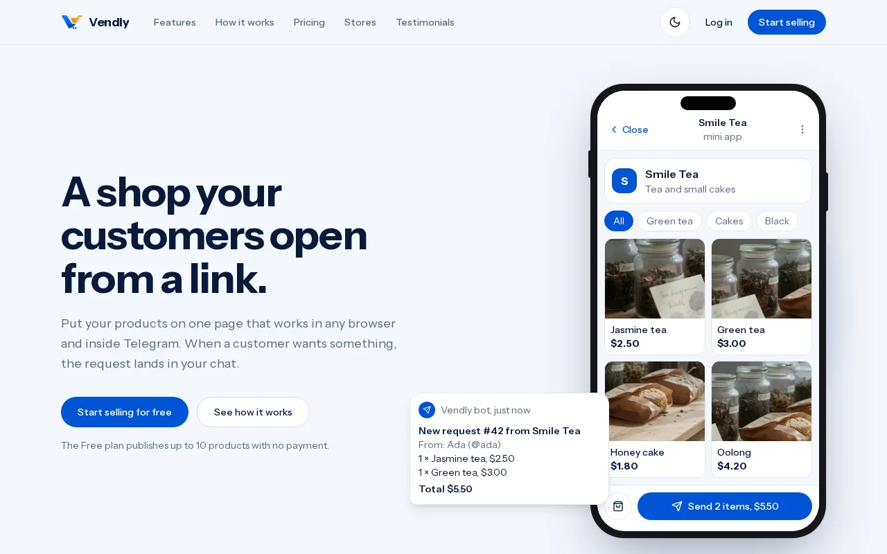
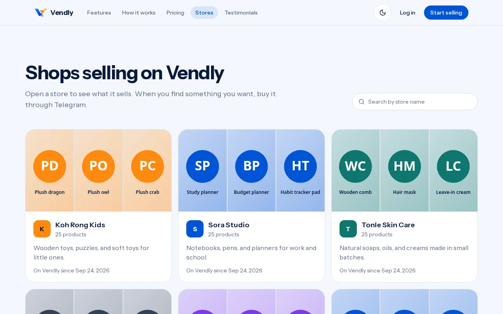
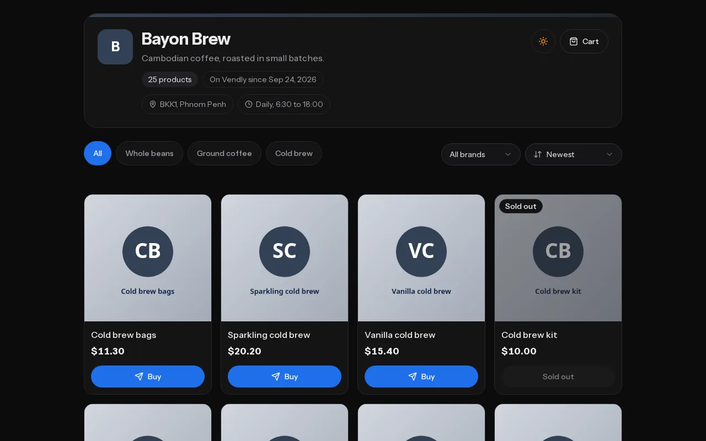
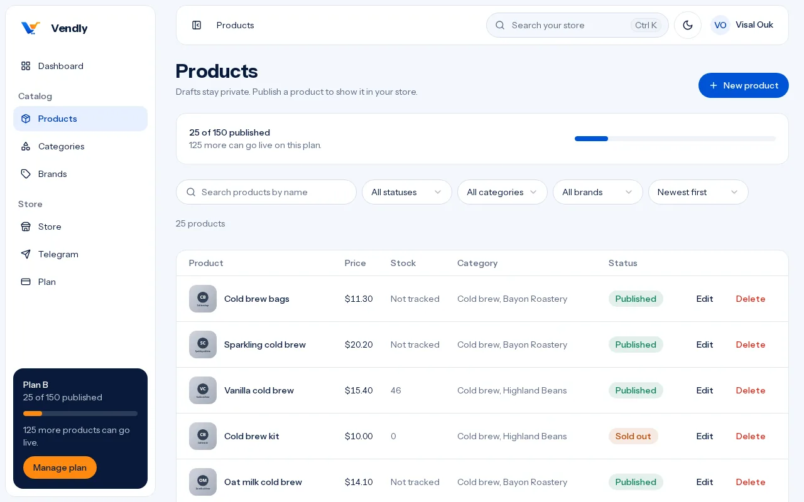

# Vendly

Vendly gives a small shop one link that opens as a web store and inside Telegram as a mini app. Customers pick products and send a buy or cart request, and the request lands in the seller's Telegram chat. Sellers pay a monthly or yearly plan by Cambodia QR (through CutLuy) for more published products; Vendly takes nothing from their sales.



| Store directory                                  | A storefront (dark theme)                       | The vendor dashboard                                       |
| ------------------------------------------------ | ----------------------------------------------- | ---------------------------------------------------------- |
|  |  |  |

## Who uses it

- **Customers** browse a store on the web or in Telegram, add products to a cart, and send a request. On the web, Buy opens the product in the Telegram mini app.
- **Vendors** open one store, manage products, categories, brands, and the store profile, connect their Telegram chat, and pay for a plan.
- **Admins** see every vendor, manage plans, payments, requests, testimonials, and the website footer, and set up Telegram, CutLuy, and Google sign-in.

## Stack

| Part                             | Version                                                      |
| -------------------------------- | ------------------------------------------------------------ |
| PHP                              | 8.4                                                          |
| Laravel                          | 13                                                           |
| Inertia (Laravel and React)      | 3                                                            |
| React                            | 19                                                           |
| Tailwind CSS                     | 4                                                            |
| TypeScript                       | 5                                                            |
| Vite                             | 8                                                            |
| Laravel Fortify (auth)           | 1.40                                                         |
| Laravel Socialite (Google)       | 5                                                            |
| Laravel Wayfinder (typed routes) | 0.1                                                          |
| Pest                             | 5                                                            |
| PostgreSQL                       | production and local development; tests use SQLite in memory |

The UI uses shadcn/ui components on Radix, and the charts are plain SVG with no chart library.

## Local setup

Requirements: PHP 8.4 with the usual Laravel extensions, Composer, Node.js 22 or newer, and PostgreSQL.

```bash
git clone git@github.com:srosthai/vendly.git
cd vendly
composer setup            # install, copy .env, generate the key, migrate, build assets
```

Then set the database in `.env` (`DB_CONNECTION=pgsql` and the `DB_*` values), and:

```bash
php artisan migrate
php artisan db:seed       # plans, the demo accounts, and the demo stores (local only)
php artisan storage:link  # serves logos, photos, and avatars from storage
composer run dev          # app server, queue worker, logs, and Vite together
```

Open the `APP_URL` from `.env` (for example `http://127.0.0.1:8000`).

### Testing on a public address (Cloudflare Tunnel)

Telegram (the mini app and webhooks), CutLuy webhooks, and Google sign-in need a public https address. A Cloudflare Tunnel gives the local app one, for example `https://vendly.srosthai.me`.

One-time setup, with the domain's zone on your Cloudflare account and [`cloudflared`](https://developers.cloudflare.com/cloudflare-one/connections/connect-networks/downloads/) installed:

```bash
cloudflared tunnel login                                   # pick the domain's zone in the browser
cloudflared tunnel create vendly
cloudflared tunnel route dns vendly vendly.srosthai.me
```

Then point the tunnel at the app in `~/.cloudflared/vendly.yml` (its own file, so other tunnels on the machine keep their config):

```yaml
tunnel: vendly
credentials-file: /home/<you>/.cloudflared/<tunnel-id>.json
ingress:
    - hostname: vendly.srosthai.me
      service: http://127.0.0.1:8000
    - service: http_status:404
```

Set `APP_URL=https://vendly.srosthai.me` in `.env` (uploaded images and emails use it), then run:

```bash
composer run tunnel       # builds assets, then runs the app, queue worker, and tunnel together
```

The tunnel serves built assets, because the Vite dev server only listens on localhost. Run `composer run dev` again for local work with hot reload.

### Demo accounts (local and testing only)

The seeders refuse to run in production, because these accounts share a public password.

| Email                                           | Password   | Role                                                      |
| ----------------------------------------------- | ---------- | --------------------------------------------------------- |
| `admin@vendly.test`                             | `password` | Admin                                                     |
| `vendor@vendly.test`                            | `password` | Vendor (Smile Tea)                                        |
| `customer@vendly.test`                          | `password` | Customer                                                  |
| `vendor1@vendly.test` to `vendor10@vendly.test` | `password` | Demo vendors, each with a store on Plan B and 25 products |

The demo testimonials are invented quotes for trying the website locally.

## Configuration

Values saved in **Admin → Site settings** and **Admin → Telegram** take over from `.env`, so a deployment can be set up without editing the server environment. The `.env` values remain the fallback.

| Service                               | `.env` keys                                                                                                                                                      | Managed in the admin                                                              |
| ------------------------------------- | ---------------------------------------------------------------------------------------------------------------------------------------------------------------- | --------------------------------------------------------------------------------- |
| Telegram bot and mini app             | `TELEGRAM_BOT_TOKEN`, `TELEGRAM_BOT_USERNAME`, `TELEGRAM_MINI_APP_SHORT_NAME`, `TELEGRAM_ADMIN_CHAT_ID`, `TELEGRAM_WEBHOOK_SECRET`, `TELEGRAM_INIT_DATA_MAX_AGE` | Bot username, mini app short name, and admin chat id                              |
| CutLuy payments                       | `CUTLUY_API_KEY`, `CUTLUY_WEBHOOK_SECRET`, `CUTLUY_BASE_URL`                                                                                                     | All three (the key and secret are stored encrypted and never sent to the browser) |
| Google sign-in                        | `GOOGLE_CLIENT_ID`, `GOOGLE_CLIENT_SECRET`, `GOOGLE_REDIRECT_URI`                                                                                                | On or off, client id, and client secret (encrypted)                               |
| Mail (sign-up codes, password resets) | `MAIL_*`                                                                                                                                                         | No                                                                                |

The bot token and the Telegram webhook secret stay in `.env`.

### Webhooks

| Endpoint                  | Sender                                                  | Signed with                                                |
| ------------------------- | ------------------------------------------------------- | ---------------------------------------------------------- |
| `POST /webhooks/telegram` | Telegram (bot updates, used to connect a vendor's chat) | `TELEGRAM_WEBHOOK_SECRET`, sent as the secret token header |
| `POST /webhooks/cutluy`   | CutLuy (payment events)                                 | The CutLuy webhook secret                                  |

The admin Telegram and Site settings pages show the exact addresses to paste into each service.

## Running in production

- **Queue worker:** Telegram messages and CutLuy events are queued. Run `php artisan queue:work` (or Laravel Cloud's worker).
- **Scheduler:** `subscriptions:expire` runs daily to end lapsed paid plans. Run `php artisan schedule:work`, or a cron entry for `php artisan schedule:run` every minute.
- **Storage:** run `php artisan storage:link` once, or use a public disk such as S3.
- **Assets:** `npm run build`.

## Quality checks

```bash
php artisan test --compact     # Pest feature and unit tests
vendor/bin/pint                # PHP formatting
vendor/bin/phpstan analyse     # static analysis (Larastan)
npm run check                  # lint and format (vp check)
npm run types:check            # TypeScript
```

Project conventions for contributors and coding agents are in `AGENTS.md`. The product plan is in `docs/plan.md`.
